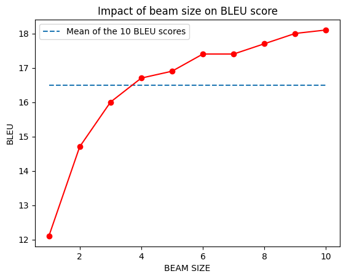

# MT Exercise 5: Byte Pair Encoding, Beam Search

**Due date: Friday, May 29 2020, 14:00**

This repository contains scripts and translation results for the 5th exercise of the machine translation course, 
as well as feedback for this assignment.

# Requirements

- This only works on a Unix-like system, with bash.
- Python 3 must be installed on your system, i.e. the command `python3` must be available
- Make sure virtualenv is installed on your system. To install, e.g.

    `pip install virtualenv`

# Steps

Clone this repository in the desired place and check out the correct branch:

    git clone https://github.com/bricksdont/joeynmt-toy-models
    cd joeynmt-toy-models
    checkout ex5

Create a new virtualenv that uses Python 3. Please make sure to run this command outside of any virtual Python environment:

    ./scripts/make_virtualenv.sh

**Important**: Then activate the env by executing the `source` command that is output by the shell script above.

Download and install required software:

    ./scripts/download_install_packages.sh

Download prepared data:

    ./scripts/download_data.sh

Preprocess data:

    ./scripts/preprocess.sh

Then finally train a model:

    ./scripts/train.sh

The training process can be interrupted at any time, and the best checkpoint will always be saved.

Evaluate trained models for task 1 with

    ./scripts/evaluate.sh

Evaluate trained models for task 2 with

    ./scripts/evaluate_beam.sh

# Feedback

All the changes were made on the branch [ex5](https://github.com/jo0704/joeynmt-toy-models/tree/ex5) on our github repository.

## Data

The language pair and translation direction that we chose is de-en.

## Training

BPE: vocabulary size was first initialized with 2000 subwords. Then, we trained our BPE model with 5000 and 1000 words.
Regarding the training time with a GPU-enabled machine, we increased the number of epochs from 2 to 8.

## Results: Task 1

We get the following results for BLEU scores:

| use BPE | vocabulary size | BLEU |
| ---: | ---: | ---: |
| no | 2000 | 15.8 |
| yes | 2000 | 16.9 |
| yes | 5000 | 9.3 |
| yes | 10000 | 5.8 |

This table shows two main interesting discoveries:
First, if we compare the word model to the BPE model, 
we get a slightly higher BLEU score with subwords if we consider the vocabulary size of 2000.
Thus, low-resource set up can benefit from BPE, but in a constrained way: 
the vocabulary size plays a important role here.
Second, when we increase the vocabulary size with a BPE model, the performance decreases.
Possible reasons/interpretations for this:
As the vocabulary size influences the number of operations that have to be performed at each decoding step,
this means that the computational complexity increases dramatically if we increase the vocabulary size.

How do translations differ if we look at them manually?
The first linguistic phenomena that stood out to us was the repetition of the expression 'you know'.
As the vocabulary size increases, the expression becomes even more redundant and impacts the fluency and
coherence of the sentence even more. 
Adding to that, there are other redundant repetitions of words/expressions.
Just looking of some fragments of text, the less the vocabulary size, the more the sentences would make sense. However, the coherence on document-level is almost non-existent.

Let's discuss the first sentence to have a clearer idea of how the translations differ.

Source in German: "Vor einigen Jahren, hier bei TED, stellte Peter Skillman einen Design-Wettbewerb namens "Die Marshmallow-Herausforderung" vor."

Reference translation: "Several years ago here at TED, Peter Skillman  introduced a design challenge  called the marshmallow challenge."

BPE-vocabulary size 2000: "Several officer, at TED, Peter Skillman introduced a design of the marshmallow." 
Here, the general meaning of the sentence is contained, even though some grammatical mistakes appear, and the first part of the sentence doesn't mean much.

BPE-vocabulary size 5000: "Several: Second, Several, last of the time, you know, Peter Skillman introduced a design of the marshmallow."
Here, the sentence completely looses its fluency and becomes redundant. If we only consider the second part of the sentence, we could say that the general meaning is maintained. 

BPE-vocabulary size 10000: "You know, Several at TED, Peter Skillman, and Peter Skillman, who is the marshmallow."
Here, the sentence is not fluent either, but what's worse is the redundant repetition of the person's name and the fact that the meaning to which "marshmallow" is assigned has changed (from designing the marshmallow to being the marshmallow).

Analyzing just one sentence and looking at the text generally, we can understand why the BLEU score is so low and stick with the vocabulary size of 2000. 

## Results: Task 2

In order to investigate how beam size influences BLEU score, we trained our best model:
**BPE with vocaulary size of 2000** and translated the test set 10 times, each time varying the beam size. 

| Beam size | BLEU |
| ---: | ---: |
| 1 | 12.1 |
| 2 | 14.7 |
| 3 | 16.0 |
| 4 | 16.7 |
| 5 | 16.9 |
| 6 | 17.4 |
| 7 | 17.4 |
| 8 | 17.7 |
| 9 | 18.0 |
| 10 | 18.1 |

We plotted a graph to show the results we got 

This graph can be found as an image under:

    bleu_beam.png

In order to produce the graph, we created a python script:

    graph.py

When testing with different beam sizes, we can first observe that the more we approach the beam size of 10, the higher the BLEU score.
With very low beam sizes like 1 or 2, the BLEU score increases faster than with higher beam sizes like 9 or 10. 
Thus, increasing beam size when it's very low has certainly the greatest impact on BLEU.
The last beam size we tested was 10, and we can see that the impact on BLEU between size 9 and 10 is very minimal. 
This tells us that increasing beam size after that last test will probably not increase BLEU that much, or even more minimally.
When we first trained, we started with beam size of 5. In the future, we would choose a higher size, like 9 or 10, 
since our observations showed that we can improve translation quality.

## Problems

If 2-3 models were training one after another without stopping in a single bash script, 
after first model was trained,
there would be an error indicating GPU memory was full and training process could not be proceeded, 
actually we think it might be a bug from pytorch because pytorch didn't reallocate GPU memory to new training sessions 
after previous sessions were already finished. 
The solution is simple but annoying: rebooting the computer to empty the GPU memory will solve the problem in no time.
